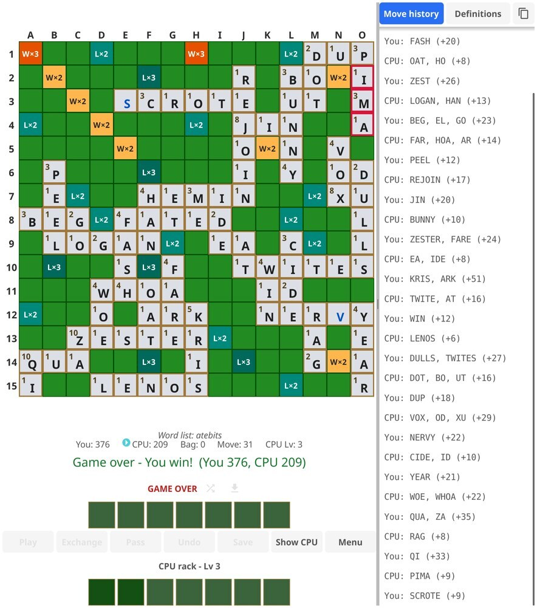
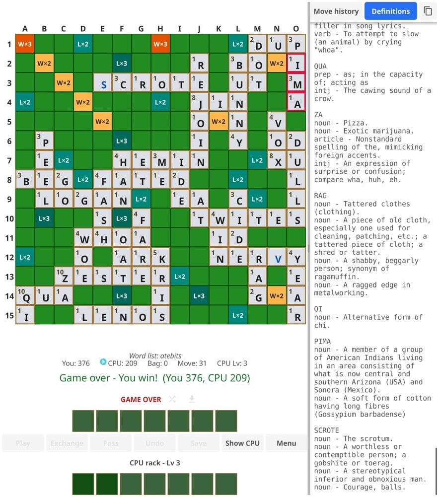
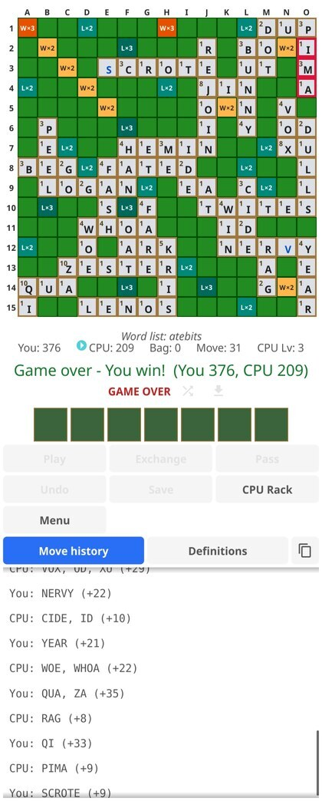
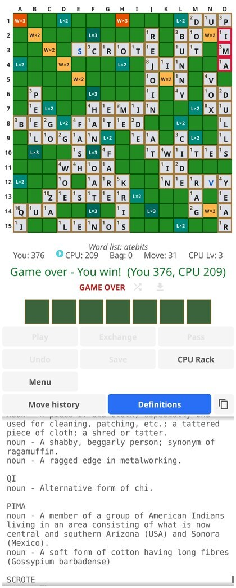

# TileWords

A free, fully open-source, fully offline Scrabble®-like crossword tile game, written in Go with [Fyne](https://fyne.io/).

See the note at the very bottom for why I felt the need to make this. And yes, this was built using AI. The note explains that too.

<p align="center">
  <a href="screenshots/gameboard-wide-movehist-normal.jpg"></a>
  &emsp;&emsp;&emsp;
  <a href="screenshots/gameboard-wide-defs.jpg"></a>
  &emsp;&emsp;&emsp;
  <a href="screenshots/gameboard-narrow-movehist-normal.jpg"></a>
  &emsp;&emsp;&emsp;
  <a href="screenshots/gameboard-narrow-defs.jpg"></a>
</p>

<p align="center"><em>Wide and narrow layouts, each with the move-history and definitions panels. Click any image for the full-size version.</em></p>

## What's All This, Then?

TileWords is a Scrabble®-like offline crossword tile game in which you play against the computer, using individual letters to construct cromulent words on a game board to gain the endorphin hit from watching those sweet sweet points _racking_ (heh heh) up. Plus, since it shows the definitions for words whose definitions it knows, it's a learning tool too!

TileWords uses public-domain and libre/freely available word lists and definitions. No proprietary lexicons were harmed during the making of this game.

While it is currently a fully offline game, if there is sufficient interest in adding Player-vs-Player functionality, network access (and hence the requisite permissions on mobile platforms) will of course be required when it is implemented.

### Legal Guff (a.k.a. "Please don't sue me")

SCRABBLE® is a registered trademark. All intellectual property rights in and to SCRABBLE® are owned in the U.S.A. by Hasbro Inc., in Canada by Hasbro Canada Inc. and throughout the rest of the world by J.W. Spear & Sons Ltd. of England, a subsidiary of Mattel Inc.

The "Android" name, the Android logo, the "Google Play" brand, and other Google trademarks, are property of Google LLC (whom I non-lovingly call "Gurgle").

All other external-entity trademarks, names, logos, and service marks (collectively "trademarks") in this product are the registered and unregistered trademarks of their respective owners.

**TileWords is NOT affiliated with any of the above-mentioned products or entities.**

## What's It Got?

- **Free, offline and private:** the game is open-source, requires no payment, and will never track you or show you ads. It needs no network connection and requests no internet permission. Everything runs on your device.
- **Free and libre word lists:** at the start of each game, choose from three openly-licensed dictionaries - ENABLE2K, the Wordnik word list, and the atebits "Words" (Letterpress) list. Full attribution is in the [My Word!](#my-word) section.
   - The word list artefacts created during the build process are in an optimized form to minimize disk and memory usage on mobile devices.
- **Word definitions:** the meaning of each word played is shown, drawn from Wiktionary, Webster's 1913, WordNet, and other libre / public-domain glossaries. The UI shows "no definition found" for a word that lacks a definition.
   - Like the word lists, the definitions artefact is stored in a compact flat form and streamed in at load, decreasing memory requirements.
- **Two game modes:** Classic Mode uses the standard 15x15 premium-square layout and tile economy, while Interesting Mode uses an alternative pinwheel (4-fold rotational) layout with a different tile distribution and per-tile points. A preview shows each mode's board and tiles before you start.
- **Selectable CPU difficulty:** choose how strongly the computer opponent plays, from 1 (easy) to 10 (hard). Even at level 10, the CPU is not infallible - just like a human being. At level 11, it is - this is Demigod Mode (for the CPU, not you). To quote from `This is Spinal Tap`: _"Why don't you just make 10 louder and make 10 be the top number?"_ **/** _"...These go to ELEVEN!"_
- **Multiple ways to interact with the tiles and game board:**
   - To place a rack tile on the board, drag it onto the board, or click/press on the tile and then the board square to place it at that square.
   - Double-tap a placed but not played board tile to return it to your rack.
   - To recall all unplayed tiles to the rack, use the recall icon on top of your rack (looks like a download icon. Why? Because that's all that was available in the UI toolkit).
   - You can also shuffle and rearrange the tiles on your rack, in case you need a fresh way of looking at things.
- **Move history:** a running log of every turn - who played, the words formed, and the score - with an option to show it in the standard official notation. The board's row and column headers - the strips a square's coordinate is read off - are a separate option, off by default so the squares have the whole board area.
- **Copy to clipboard:** the move-history and definitions panels are copyable. On desktop, select and copy; on a phone, long-press to copy the whole panel, while a finger-drag scrolls and a double or triple tap selects a word or line.
   - For convenience and visibility, a dedicated "Copy" button is also provided in the game UI which will copy the contents of the active tab (Move history or Definitions) to the system clipboard.
- **Undo:** take back the last full round - your move together with the computer's reply.
- **Save and restore:** keep a single saved game and resume it later. The save captures the board, racks, scores, move history, and game mode.
- **Remembered setup defaults:** optionally save your New Game choices - word list, game mode, difficulty, notation, and board headers - so that starting another game is a single tap.
- **Cross-platform:** runs on desktop and Android from a single codebase. Written in Go using the Fyne UI toolkit. MacOS may be supported at some time in the future, but iOS will probably never be - the Apple Store hates open source, the GPL, and developers who don't kowtow to them. Gurgle and Android are going the same way, sadly, in a horrifying game of simian mirror-neuron idiocy.
- **About and Lexicon:** an in-app dialog crediting the word lists and dictionaries, with the source links copyable to the clipboard.
- **Show/Hide CPU rack:** for those times when you need to get a leg (or at least a toe) up on a frighteningly capable machine opponent.
- **Narrow and Wide views:** On mobile devices, the game automatically switches between the narrow and wide views depending upon the available screen real estate. For foldable mobile devices, the view automatically switches to the wide view when the device is switched to using the unfolded inner screen. Desktop versions are always in wide view mode.

## How's It Built (on Linux)?

This section is written for building on Linux. You can probably adapt the instructions here to
build on Windows or on a Mac, although that's not been tested and of course you or may not have
the libraries required to cross-compile for the other desktop operating systems.

A `Makefile` is provided as your one-stop-shop build harness.
Run `make help` to see the list of available build targets.
You should _make_ sure (heh heh) to install the pre-requisites before using the `Makefile`.

### Prerequisites

- **Go 1.25 or newer** (see `go.mod`). If your distribution ships an older Go, install a current release from <https://go.dev/dl/>.
- A **C toolchain** and **OpenGL / X11 development headers** (required by Fyne).
- The **fyne CLI**, which every build target in the Makefile drives. It must be the
  **forked and patched** build from the `honor-user-ldflags` branch of
  <https://github.com/ka-iy/fyne-tools>, **not** the upstream `fyne.io/tools` one — every
  target here needs it, desktop and Android alike. One target installs it:

  ```bash
  make install-fyne-cli
  ```

  That clones the fork into a temporary directory, switches to the branch, runs
  `go install ./cmd/fyne`, and throws the clone away — so there is no checkout to keep
  up to date. It prints where the binary landed (`go env GOBIN`, or `$(go env GOPATH)/bin`
  when `GOBIN` is unset), and warns if that directory is not on your `PATH`, which it must
  be for the build targets to find it.

  The fork fixes a few things this build needs that upstream does not do:

  - it honours the linker flags the Makefile passes through `GOFLAGS` on **every** target —
    Linux, Windows and Android — which is what stamps the version, build type and build
    timestamp into the artifact; built with the upstream CLI, every artifact reports the
    `buildinfo` defaults instead;
  - for Android it signs debug APKs with the v1/v2/v3 schemes that `targetSdk` 30 and newer
    require, and emits the `<apk>.idsig` (v4) sidecar that lets `adb install` take the
    incremental path.

  **If you ever install upstream's CLI** — `go install fyne.io/tools/cmd/fyne@latest`, or
  anything that runs it for you — it overwrites the patched one, because both write the same
  `fyne` binary and the last one installed wins. Run `make install-fyne-cli` again to put the
  patched CLI back.

- `make`, `git`, `curl`, `gzip`, and `tar`.

Debian / Ubuntu:

```bash
sudo apt-get update
sudo apt-get install -y golang-go gcc pkg-config libgl1-mesa-dev xorg-dev make git curl
```

Fedora:

```bash
sudo dnf install -y golang gcc pkgconf-pkg-config mesa-libGL-devel \
  libX11-devel libXcursor-devel libXrandr-devel libXinerama-devel libXi-devel \
  libXxf86vm-devel make git curl
```

Arch:

```bash
sudo pacman -S --needed go gcc pkgconf mesa libxcursor libxrandr libxinerama libxi make git curl
```

### Get the source

```bash
git clone https://github.com/ka-iy/tilewords.git
cd tilewords
```

### The quick-n-dirty build instructions

```bash
make clean
make debug-all # The first build will take a while
```

For more detailed build instructions including how to bump up the version numbers for a release, see [BUILDING.md](BUILDING.md).

## My Word!

TileWords is built on freely available word lists and dictionaries. Grateful acknowledgement is made to the authors and maintainers of the sources below, whose work makes possible this game and the lexicon it uses.

**Word lists**

- **ENABLE2K:** the Enhanced North American Benchmark LExicon (ENABLE), 2K edition - a Scrabble®-style word list compiled by Alan Beale and others, placed in the public domain by its creators. <https://github.com/BartMassey/wordlists>
- **Wordnik word list:** Copyright (c) 2020 Wordnik, used under the MIT License. <https://github.com/wordnik/wordlist>
- **atebits "Words" (Letterpress word list):** by Loren Brichter / atebits, released under CC0 1.0 (public domain dedication). <https://github.com/atebits/Words>

**Definitions**

- **Wiktionary (English):** © Wiktionary contributors, via the kaikki.org wiktextract project, used under CC BY-SA 4.0. Definitions derived from Wiktionary remain available under the same license. <https://kaikki.org/dictionary/English/>
- **Webster's Revised Unabridged Dictionary (1913):** public domain. <https://github.com/matthewreagan/WebstersEnglishDictionary>
- **Princeton WordNet 3.1:** Copyright 2011 by Princeton University, all rights reserved, used under the WordNet License (permissive, with attribution). <https://wordnet.princeton.edu/>
- **An Etymological Dictionary of the Scottish Language:** by John Jamieson, public domain (Project Gutenberg eBook #40521). <https://www.gutenberg.org/ebooks/40521>
- **Glossary to Edmund Spenser's "The Faerie Queene", Book I:** public domain, via Wikisource. <https://en.wikisource.org/wiki/The_Faerie_Queene_(unsourced)/Book_I/Glossary>
- **Joseph Petree's OWL 2.1 from WOW24:** definitions by Joseph Petree, with his name recorded here as he asks and with his definitions unaltered (only formatting was stripped), also as he asks. Obtained via the WOW24 import compiled by Mitch Bayersdorfer, (C) 2026, released under CC BY-SA 4.0, which also credits the Word Game Players Organization (WOW24 lexicon) and Wiktionary amongst others. Note that ONLY Joseph Petree's definitions are used - NOTHING ELSE from the WOW24 import. <https://pdxscrabble.neocities.org/word-lists/WOW24-Dictionary-Import>
- **Webster's New Modern English Dictionary (1922):** public domain, OCR text via the Internet Archive. <https://archive.org/details/webstersnewmoder00web>
- **The Online Plain Text English Dictionary (OPTED) v0.03:** by Ralph S. Sutherland, public domain, derived from the Project Gutenberg etext of Webster's Unabridged Dictionary (1913). <https://www.mso.anu.edu.au/~ralph/OPTED/>

Definitions are shown for reference during play. Where more than one source defines a word, the Wiktionary sense is preferred; Webster's 1913, WordNet, and the glossaries fill gaps for archaic and dialectal words.

Every word the shipped lists accept now has a definition: coverage is 100% across `enable`, `wordnik` and `atebits-letterpress`. A handful of words that no source anywhere defines were found to be spurious; they are listed in `defs/possibly_invalid_words.txt` and dropped from the compiled dictionaries, so the game will not offer a word it cannot explain. Should a played word ever lack a definition, that is shown in the "Definitions" tab rather than passed over in silence.

----------

## A note from the (original) developer

This project was started as an experiment in using the [AWS AI-DLC framework](https://github.com/awslabs/aidlc-workflows) and Claude Code to build a word game with all the features I always wanted in my ideal word-game...uh...game _("What the hell does ZAX mean??")(It's a construction tool)_ but which I had not been able to find consolidated in one single game.

As an addendum to the experiment, I wanted to see whether I could do this without firing up my editor or manually changing stuff. I ~~almost succeeded~~ failed miserably in that endeavor.

My takeaways thus far (as of August 2026):
- Agentic coding is definitely a development accelerator **provided that** the AI is constantly hand-held, stopped from going down senseless paths, steered in the correct direction, and generally treated like a precocious idiot-savant tween.
   - Thorough testing of _ALL THE THINGS_, followed by follow-up prompts to fix things, is pretty much _de rigeur_ for getting workable stuff out of an AI. And this wasn't even that complicated a project. OK, the UI was, since I'm not a UI guy - it actually did a decent job _(well, decent to a non-GUI guy, anyway)_ of coming with a rough initial layout which I could then use as a base to tweak.
   - It is, however,really good at typing much quicker than one would be able to even if one were able to code telepathically, plus (kinda) grok large wodges of code and come up with a halfway-sensible meaning of it all. It shaved literal months off the dev timeline as compared to my going at it alone. Also see below.
- Claude Code using a non-shite (see next point) model is **unusable on a Claude Pro subscription** if you want to do any serious development.
   - The Pro subscription (for private/standalone developers) costs the same as the Teams subscription (the starting tier for companies) - USD 200 per year as of August 2026 - but has a fraction of the usage limits of Teams.
      - On Pro using the Opus 5 model at the `high` effort level (the minimum to get halfway decent code out of it), a full agent-based adversarial code review will eat through your 5-hour limit in about 20 minutes and still be only getting started _(literally; I had to wait four full times for the session usage to reset and then restart my adversarial review agents again - for the same adversarial review)_. I guess this is is Anthropic's drug-dealer cash-grab model: the first hit (Pro) is free, then ya gotta pay _mucho dinero_ (Max) for your agentic coding fix.
      - Coding tasks will likewise eat up your session limits (see next point) in nothing flat, leaving you twiddling your thumbs for the next 4-ish hours until reset.
      - Pro with extra usage is an utter waste of money - if you're going to pony up for extra usage, you might as well get one of the Max plans. Just for fun, I added USD 50 worth of extra credits, and blew through the entire lot in about an hour.
- Claude Sonnet _(whatever the version of it was that was available to Pro subscriptions before Opus 4.8 landed)_ did an **absolute shite** job of writing unsupervised code - buggy, non-functional, and generally quite useless.
   - Opus 4.8 / Opus 5 (at effort level `high`) - the current avatar of Anthropic's offering available to folks without deep pockets -  was/is **much** better at everything, but _man_ does it eat up one's token/usage allotment like a starving Great White Shark let loose in a(n aquatic) pet store. It ate my 5-hour session allotment at roughly 1% per minute, getting about two hours' worth of work before it sat down on its hands and refused to do anything until the session usage reset. I shudder to think what Fable would have done to my usage rate - probably blown through it in about five minutes flat, for no appreciable improvement over Opus 4.8 (this last bit isn't conjecture - I tried Fable at work; suffice to say that I was less than impressed by it).
- AI-DLC is alright, but perhaps needs a bit more time to mature. Also, it is verbose as all hell, which is probably OK for Enterprise(tm) Development.
   - I think I'll follow the [BMAD](https://docs.bmad-method.org/) AI SLDC framework for future development especially since that lends itself well to collaborative efforts. I'll leave the `aidlc-docs-HISTORICAL` directory in the sources as a historical record of shenanigans perpetrated.

I also had lots of fun getting the AI to write a [pseudoacademic "paper"](optimization.md) - ( ͡° ͜ʖ ͡°) - on the optimization strategies used to reduce the size of the lexicon/glossary assets.
