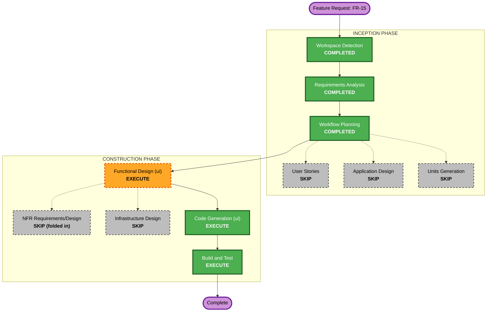

# Execution Plan — Persistent Default Setup Settings (FR-15)

## Detailed Analysis Summary

### Transformation Scope (Brownfield)
- **Transformation Type**: Single-component change (`ui`), plus a thin persistence helper.
- **Primary Changes**: Add a "Save these as my defaults" checkbox to the setup screen; add a
  settings model + a Fyne `Preferences`-backed store; load defaults into the setup controls
  on build and save them on Start Game.
- **Related Components**: none new — reuses `App.fapp.Preferences()`, `engine.GameMode`,
  `dictionary.DictName`.

### Change Impact Assessment
- **User-facing changes**: Yes — one new checkbox and pre-populated setup controls.
- **Structural changes**: No — no new architectural boundaries.
- **Data model changes**: New in-`ui` settings model serialised to preferences; no engine or
  save-file schema change (independent of `savegame.gob`).
- **API changes**: No public/contract changes.
- **NFR impact**: Extensibility (single serialised model), input validation on load
  (Security), round-trip + robustness properties (PBT), graceful fallback (Reliability).

### Component Relationships
- **Primary Component**: `ui` (`setup.go`, new settings store e.g. `ui/settings.go`).
- **Shared Components used**: `dictionary` (available-dict validation), `engine` (GameMode).
- **Dependent Components**: none — the setup screen is a leaf of the screen FSM.

### Risk Assessment
- **Risk Level**: Low — isolated, additive `ui` change.
- **Rollback Complexity**: Easy — revert the `ui` changes; preferences are optional data.
- **Testing Complexity**: Simple–Moderate — deterministic pure functions + PBT properties.

## Workflow Visualization

## Phases to Execute

### INCEPTION PHASE
- [x] Workspace Detection (COMPLETED)
- [x] Reverse Engineering (SKIPPED — brownfield, artifacts current)
- [x] Requirements Analysis (COMPLETED — FR-15 approved)
- [x] User Stories (SKIP)
  - **Rationale**: Simple, single-touchpoint enhancement; FR-15 acceptance criteria are already clear.
- [x] Workflow Planning (COMPLETED — this document)
- [ ] Application Design — **SKIP**
  - **Rationale**: Change stays within the existing `ui` component boundary; one small settings store, no new services/APIs/cross-component contracts.
- [ ] Units Generation — **SKIP**
  - **Rationale**: Single unit (`ui`); no decomposition needed.

### CONSTRUCTION PHASE
- [ ] Functional Design (ui) — **EXECUTE**
  - **Rationale**: New settings data model, persistence flow, and load-time validation rules warrant a light functional design; PBT + Security properties are specified here.
- [ ] NFR Requirements — **SKIP (folded into Functional Design)**
  - **Rationale**: No new performance/scalability concerns; the applicable NFRs (extensibility, validation, reliability) are captured in FR-15 and the functional design. Extensions remain enforced at Code Generation.
- [ ] NFR Design — **SKIP (folded in)**
- [ ] Infrastructure Design — **SKIP**
  - **Rationale**: No cloud/infrastructure.
- [ ] Code Generation (ui) — **EXECUTE (ALWAYS)**
  - **Rationale**: Implement the settings store + setup-screen wiring, with unit and property-based tests.
- [ ] Build and Test — **EXECUTE (ALWAYS)**
  - **Rationale**: Build, run the full `ui` suite incl. new PBT properties, verify.

### OPERATIONS PHASE
- [ ] Operations — PLACEHOLDER

## Success Criteria
- **Primary Goal**: The player's setup choices (word list, mode, difficulty, notation) persist
  as defaults and pre-populate the setup screen across app restarts and Main Menu → New Game.
- **Key Deliverables**: settings model + preferences store; "Save these as my defaults"
  checkbox; load-on-build + save-on-start wiring; unit + property-based tests.
- **Quality Gates**: `go build ./...`, `go vet ./ui/`, full `ui` test suite green; PBT
  round-trip and load-robustness properties pass; Security input-validation on load enforced.
